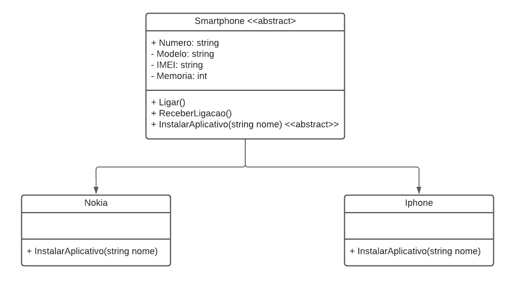

# Sistema de Celulares

Este sistema foi desenvolvido para o desafio de programação da empresa [DIO](https://www.dio.me/).
O objetivo era usar os conhecimentos adquiridos no módulo de orientação a objetos, da trilha .NET da DIO.

## Descrição

O sistema é composto por uma classe abstrata Smartphone que serve como modelo genérico para todos os celulares.
As classes Nokia e IPhone são implementações específicas que herdam de Smartphone e fornecem comportamentos exclusivos
para instalar aplicativos.

## Funcionalidades

- Ligar e receber chamadas genéricas para todos os smartphones.
- Instalar aplicativos específicos para cada modelo de celular.

## Estrutura do projeto

```
├───SistemaCelulares
│   ├───Models
│   │       IPhone.cs
│   │       Nokia.cs
│   │       Smartphone.cs
│   │
│   └───Program.cs
```

## Diagrama de classes



## Uso

O programa principal ([`Program.cs`](Program.cs)) contém exemplos de como usar as classes Nokia e IPhone.

```csharp
using SistemaCelulares.Models;

Console.WriteLine("Smartphone Nokia:");
Smartphone nokia = new Nokia(numero: "123456", modelo: "Modelo 1", imei: "111111111", memoria: 64);
nokia.Ligar();
nokia.InstalarAplicativo("Whatsapp");

Console.WriteLine("\n");

Console.WriteLine("Smartphone iPhone:");
Smartphone iphone = new IPhone(numero: "4987", modelo: "Modelo 2", imei: "222222222", memoria: 128);
iphone.ReceberLigacao();
iphone.InstalarAplicativo("Telegram");
```

## Contribuição

Sinta-se à vontade para contribuir com melhorias, correções de bugs ou adicionar novos recursos. Basta seguir as
diretrizes de contribuição.

## Licença

Este projeto está licenciado sob a licença MIT - consulte o arquivo [LICENSE.md](LICENSE.md) para obter detalhes.
